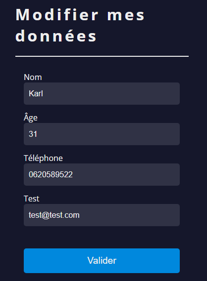

# sg form lib

Librairie ReactJS simplifiant la création de formulaires. <br>
La validation du formulaire utilise useForm de React. <br>
[Tester la librairie sur CodeSandBox](https://codesandbox.io/p/sandbox/sg-form-lib-test-6dd48x?file=%2Fsrc%2Findex.js&layout=%257B%2522sidebarPanel%2522%253A%2522EXPLORER%2522%252C%2522rootPanelGroup%2522%253A%257B%2522direction%2522%253A%2522horizontal%2522%252C%2522contentType%2522%253A%2522UNKNOWN%2522%252C%2522type%2522%253A%2522PANEL_GROUP%2522%252C%2522id%2522%253A%2522ROOT_LAYOUT%2522%252C%2522panels%2522%253A%255B%257B%2522type%2522%253A%2522PANEL_GROUP%2522%252C%2522contentType%2522%253A%2522UNKNOWN%2522%252C%2522direction%2522%253A%2522vertical%2522%252C%2522id%2522%253A%2522clwrr2ejy0007356ifeicrgug%2522%252C%2522sizes%2522%253A%255B100%252C0%255D%252C%2522panels%2522%253A%255B%257B%2522type%2522%253A%2522PANEL_GROUP%2522%252C%2522contentType%2522%253A%2522EDITOR%2522%252C%2522direction%2522%253A%2522horizontal%2522%252C%2522id%2522%253A%2522EDITOR%2522%252C%2522panels%2522%253A%255B%257B%2522type%2522%253A%2522PANEL%2522%252C%2522contentType%2522%253A%2522EDITOR%2522%252C%2522id%2522%253A%2522clwrr2ejy0003356igqhqnukr%2522%257D%255D%257D%252C%257B%2522type%2522%253A%2522PANEL_GROUP%2522%252C%2522contentType%2522%253A%2522SHELLS%2522%252C%2522direction%2522%253A%2522horizontal%2522%252C%2522id%2522%253A%2522SHELLS%2522%252C%2522panels%2522%253A%255B%257B%2522type%2522%253A%2522PANEL%2522%252C%2522contentType%2522%253A%2522SHELLS%2522%252C%2522id%2522%253A%2522clwrr2ejy0004356izyjv1wsx%2522%257D%255D%252C%2522sizes%2522%253A%255B100%255D%257D%255D%257D%252C%257B%2522type%2522%253A%2522PANEL_GROUP%2522%252C%2522contentType%2522%253A%2522DEVTOOLS%2522%252C%2522direction%2522%253A%2522vertical%2522%252C%2522id%2522%253A%2522DEVTOOLS%2522%252C%2522panels%2522%253A%255B%257B%2522type%2522%253A%2522PANEL%2522%252C%2522contentType%2522%253A%2522DEVTOOLS%2522%252C%2522id%2522%253A%2522clwrr2ejy0006356irn6buu5u%2522%257D%255D%252C%2522sizes%2522%253A%255B100%255D%257D%255D%252C%2522sizes%2522%253A%255B50%252C50%255D%257D%252C%2522tabbedPanels%2522%253A%257B%2522clwrr2ejy0003356igqhqnukr%2522%253A%257B%2522tabs%2522%253A%255B%257B%2522id%2522%253A%2522clwrr2ejy0002356i9luoahw0%2522%252C%2522mode%2522%253A%2522permanent%2522%252C%2522type%2522%253A%2522FILE%2522%252C%2522initialSelections%2522%253A%255B%257B%2522startLineNumber%2522%253A14%252C%2522startColumn%2522%253A1%252C%2522endLineNumber%2522%253A14%252C%2522endColumn%2522%253A1%257D%255D%252C%2522filepath%2522%253A%2522%252Fsrc%252Findex.js%2522%252C%2522state%2522%253A%2522IDLE%2522%257D%255D%252C%2522id%2522%253A%2522clwrr2ejy0003356igqhqnukr%2522%252C%2522activeTabId%2522%253A%2522clwrr2ejy0002356i9luoahw0%2522%257D%252C%2522clwrr2ejy0006356irn6buu5u%2522%253A%257B%2522tabs%2522%253A%255B%257B%2522id%2522%253A%2522clwrr2ejy0005356i3bmdvkpd%2522%252C%2522mode%2522%253A%2522permanent%2522%252C%2522type%2522%253A%2522UNASSIGNED_PORT%2522%252C%2522port%2522%253A0%252C%2522path%2522%253A%2522%252F%2522%257D%255D%252C%2522id%2522%253A%2522clwrr2ejy0006356irn6buu5u%2522%252C%2522activeTabId%2522%253A%2522clwrr2ejy0005356i3bmdvkpd%2522%257D%252C%2522clwrr2ejy0004356izyjv1wsx%2522%253A%257B%2522tabs%2522%253A%255B%255D%252C%2522id%2522%253A%2522clwrr2ejy0004356izyjv1wsx%2522%257D%257D%252C%2522showDevtools%2522%253Atrue%252C%2522showShells%2522%253Afalse%252C%2522showSidebar%2522%253Atrue%252C%2522sidebarPanelSize%2522%253A15%257D)

## Introduction

Cette librairie contient un composant `Form` qui permet de créer facilement des formulaires, en utilisant soit des champs prédéfinis dans la librairie, soit en ajoutant vos propres champs. Les champs prédéfinis vous offrent une structure de base pour créer vos formulaires.
La gestion des erreurs est prise en compte. <br>
Il est possible d'ajouter des pattern et de définir quels champs sont requis. <br>
Il suffit de mettre les props adaptées. <br>
La séléction des champs se fait dans la prop `fieldNames`, ensuite le formulaire va automatiquement récupérer les données nécessaires dans le fichier de configuration. <br>
L'action à réaliser à l'envoi du formulaire se fait via la prop `onSubmitFunction`, à laquelle vous passez la fonction souhaitée.<br>
Attention a bien passer les paramètres de cette fonction dans le même ordre que les champs car la récupération des données se fait automatiquement en allant du premier champ au dernier champ. <br>
Exemple : <br>

```jsx
const handleForm = (email, password)
<Form
        fieldsConfig={fieldConfigPerso}
        title={'Se connecter'}
        btnText={'Connexion'}
        onSubmitFunction={handleForm}
        validationMessage={validationMessage}
        errorMessage={errorMessage}
        fieldNames={['email', 'password']}
/>

```

## Champs prédéfinis

Par défaut les champs sont requis. <br>

Les champs prédéfinis incluent :

- email (input) <br>
- password (input de type password)
- passwordConfirmation (input de type password)
- name (input)
- age (input type number)
- tel (input)
- message (textarea)
- otherInfos (textarea)
- gender (radio button)
- country (select)
- foodAllergies (checkbox)
  <br>

### Exemples :

- Input : <br>

```jsx
  email: {
    label: 'Email',
    type: 'email',
    pattern: /\S+@\S+\.\S+/,
    fieldErrorMessage: 'Veuillez renseigner votre email',
    isRequired,
  },
```

- Textarea : <br>

```jsx
  message: {
    tag: 'textarea',
    label: 'Message',
    type: 'text',
    fieldErrorMessage: 'Veuillez renseigner votre message',
    isRequired,
  },
```

- Radio buttons : <br>

```jsx
  gender: {
    tag: 'radio',
    type: 'radio',
    label: 'Genre',
    fieldErrorMessage: 'Veuillez renseigner votre genre',
    isRequired,
    radios: [
      {
        label: 'Homme',
        value: 'Homme',
        name: 'male',
      },
      {
        label: 'Femme',
        value: 'Femme',
        name: 'female',
      },
    ],
  },
```

- Select : <br>

```jsx
  country: {
    tag: 'select',
    label: 'Pays',
    defaultValue: 'Choisir une option',
    fieldErrorMessage: 'Veuillez renseigner votre pays',
    isRequired,
    options: [
      {
        label: 'Angleterre',
        value: 'Angleterre',
      },
      {
        label: 'Espagne',
        value: 'Espagne',
      },
      {
        label: 'France',
        value: 'France',
      },
    ],
  },
```

- Checkboxes : <br>

```jsx
  foodAllergies: {
    tag: 'checkbox',
    type: 'checkbox',
    label: 'Allergie(s) alimentaire(s)',
    isRequired: false,
    checkboxes: [
      {
        label: 'Gluten',
        value: 'gluten',
        name: 'gluten',
      },
      {
        label: 'Arachides',
        value: 'peanuts',
        name: 'peanuts',
      },
      {
        label: 'Lactose',
        value: 'milk',
        name: 'milk',
      },
    ],
  },
```

## Personnalisation des champs

Par défaut, le composant Form se base sur le fichier `default-config.jsx`, présent dans la librairie. <br>
Ce dernier vous permet de prendre connaissance du format attendu pour chaque type de champs. <br>
Il est possible de définir votre propre fichier de configuration. <br>
Vous pouvez copier le contenu du fichier `default-config.jsx` présent dans `node_modules/sg-form-lib/config/`, <br>
Ensuite, où vous le souhaitez vous pouvez créer un fichier personnel (ex : fieldConfigPerso.jsx) et coller le contenu précédemment copié. <br>
En fonction de vos besoin, vous pouvez ajouter, modifier ou supprimer ce qui s'y trouve. <br>
Pensez à garder le bon format adapté à chaque type de champ. <br>
Lorque vous utilisez le composant Form, ajoutez la prop : `fieldsConfig={fieldConfigPerso}` <br>
Pensez au préalable à importer votre fichier : <br>

```jsx
import { fieldConfigPerso } from '../fieldConfigPerso';
```

## Classes CSS utilisées

Le composant Form a une largeur de 100%, penser à le mettre dans un container <br>

Pour personnaliser le style des formulaires, vous pouvez utiliser les classes CSS suivantes :

- sg-form-lib
- sg-form-lib\_\_section-title
- sg-form-lib\_\_title
- sg-form-lib\_\_subtitle
- sg-form-lib\_\_content
- sg-form-lib\_\_message--validation
- sg-form-lib\_\_message--error
- sg-form-lib\_\_data
- sg-form-lib\_\_data--error
- sg-form-lib\_\_label
- sg-form-lib\_\_input
- sg-form-lib\_\_textarea
- sg-form-lib\_\_checkboxes
- sg-form-lib\_\_checkbox
- sg-form-lib\_\_radios
- sg-form-lib\_\_radio
- sg-form-lib\_\_select

## Pré-remplissage du formulaire

Vous pouvez pré-remplir le formulaire avec des données en utilisant la prop `fieldValue`, qui doit être un objet JSON contenant les données. Le nom du champ dans les données doit correspondre au `fieldName` du formulaire. <br>

Exemple :

```json
// data.json
{
  "name": "Karl",
  "age": 31,
  "tel": "0620589522",
  "email": "test@test.com",
  "password": "Test1234*"
}
```

```jsx
import datas from '../assets/data.json';

<Form
  fieldsConfig={fieldConfigPerso}
  title={'Modifier mes données'}
  btnText={'Valider'}
  onSubmitFunction={handleForm}
  validationMessage={validationMessage}
  errorMessage={errorMessage}
  fieldNames={['name', 'age', 'tel', 'email']}
  fieldValue={datas}
/>;
```



## Installation

Via npm : <br>
`npm i sg-form-lib`
<br>
Via yarn : <br>
`yarn add sg-form-lib`
<br>
Via pnpm : <br>
`pnpm i sg-form-lib`
<br>

N'oubliez pas d'ajouter le CSS dans votre fichier d'entrée (index.jsx ou main.jsx) :

```jsx
import 'sg-form-lib/style.css';
```

<br>
Assurez-vous de l'importer avant tout autre CSS pour pouvoir le personnaliser correctement.<br>

## Exemple d'utilisation

```jsx
import { useState } from 'react';
import { Form } from 'sg-form-lib';
import data from '../assets/data.json';
import { fieldConfigPerso } from '../fieldConfigPerso';

const DemoConnexion = () => {
  const [validationMessage, setValidationMessage] = useState('');
  const [errorMessage, setErrorMessage] = useState('');

  const handleForm = (email, password) => {
    try {
      setErrorMessage('');
      if (email === data.email && password !== data.password) {
        throw new Error('Mot de passe incorrect');
      }
      if (email === data.email && password === data.password) {
        // Here you can manage action when form is well submitted
        setValidationMessage('Formulaire envoyé');
      } else {
        throw new Error('Combinaison incorrect');
      }
    } catch (error) {
      setValidationMessage('');
      setErrorMessage(error.message);
    }
  };
  return (
    <div className='container'>
      <Form
        fieldsConfig={fieldConfigPerso}
        title={'Se connecter'}
        btnText={'Connexion'}
        onSubmitFunction={handleForm}
        validationMessage={validationMessage}
        errorMessage={errorMessage}
        fieldNames={['email', 'password']}
      />
    </div>
  );
};

export default DemoForm;
```

### Props du composant Form

Ce composant bénéficie d'une ref 'form' : <br>
` const form = useRef();`<br>

````jsx
<form
      onSubmit={handleSubmit(() =>
        onSubmitFunction(...fieldNames.map((fieldName) => getValues(fieldName)))
      )}
      className='sg-form-lib'
      id={formId}
      ref={form}
      noValidate // validate by useForm hook
    >
    ```

- btnText (string, required) : Le texte du bouton de soumission du formulaire.<br>
- onSubmitFunction (function, required) : La fonction à appeler lors de la soumission du formulaire.<br>
- fieldNames (array of strings, required) : Les noms des champs à inclure dans le formulaire.<br>
- fieldsConfig (object) : La configuration des champs. (Facultatif, utilise la configuration par défaut si non spécifiée)<br>
- title (string) : Le titre du formulaire. (Facultatif)<br>
- subtitle (string) : Le sous-titre du formulaire. (Facultatif)<br>
- validationMessage (string) : Le message de validation à afficher. (Facultatif)<br>
- errorMessage (string) : Le message d'erreur à afficher. (Facultatif)<br>
- fieldValue (object) : Les valeurs initiales des champs. (Facultatif)<br>
- id (string) : l'id correspondant au form.
````
